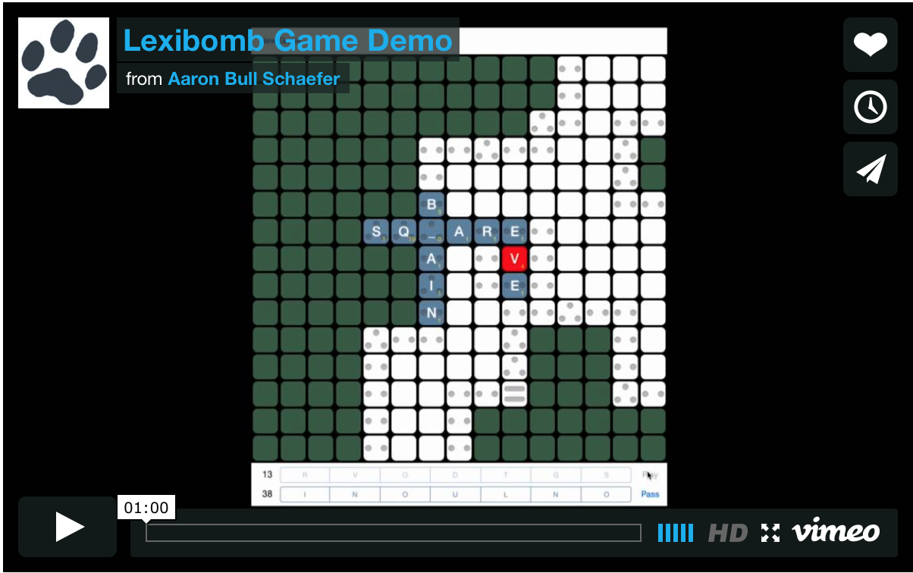

Lexibomb
========

A tile-based word game similar to Scrabble, but the letter and word multipliers
for each game are based on the proximity to randomly placed bombs. As the
neighboring bomb counts get higher (think Minesweeper), the larger the
multiplier grows for your letter/word...although if you hit a bomb, your word
earns no points.

- The initial board gives no clue as of to where the bombs are located.
- Play tiles anywhere and it will open up the board information like clicks in
  Minesweeper.

[](https://vimeo.com/elasticdog/lexibomb-demo)

### Gameplay Notes

- The play button only becomes enabled when a valid play is on the board
  (meaning proper placement of tiles and creating words that exist in the
  dictionary).
- You do not have to specify a letter for blank tiles, all possible words are
  tested. This also means that the blank tiles may represent different letters
  for words in the differing orientations (vertical / horizontal).


Scoring
-------

| Tile | Multiplier | Neighboring Bombs | Notes |
|:----:|:----------:|:-----------------:|:-----:|
|  | 1 x L | 0 | Letters played on these tiles are worth thier face value |
|  | 2 x L | 1 | Double letter tile |
|  | 3 x L | 2 | Triple letter tile |
|  | 2 x W | 3 | Double word tile |
|  | 3 x W | 4+ | Triple word tile |
|  | 0 x W<sup>*</sup> | N/A | Bomb tile; no points awarded for this word |

\* _Note: The 0 x W multiplier for bomb tiles only happens when the tile is first revealed...subsequent turns treat the spot as a 1 x L._

| Tile | Notes |
|:----:|:-----:|
|  | Gray tiles are shown for the current player's turn, before final submission |
|  | Blue tiles are shown for all previously played tiles |

### Letter Points

<table>
<colgroup>
<col style="text-align:center;"/>
</colgroup>

<thead>
<tr>
    <th style="text-align:center;" colspan="14">A - M</th>
</tr>
</thead>

<tbody>
<tr>
    <td style="text-align:center;"><em>Letter</em></td>
    <td style="text-align:left;">A</td>
    <td style="text-align:left;">B</td>
    <td style="text-align:left;">C</td>
    <td style="text-align:left;">D</td>
    <td style="text-align:left;">E</td>
    <td style="text-align:left;">F</td>
    <td style="text-align:left;">G</td>
    <td style="text-align:left;">H</td>
    <td style="text-align:left;">I</td>
    <td style="text-align:left;">J</td>
    <td style="text-align:left;">K</td>
    <td style="text-align:left;">L</td>
    <td style="text-align:left;">M</td>
</tr>
<tr>
    <td style="text-align:center;"><em>Points</em></td>
    <td style="text-align:left;">1</td>
    <td style="text-align:left;">3</td>
    <td style="text-align:left;">3</td>
    <td style="text-align:left;">2</td>
    <td style="text-align:left;">1</td>
    <td style="text-align:left;">4</td>
    <td style="text-align:left;">2</td>
    <td style="text-align:left;">4</td>
    <td style="text-align:left;">1</td>
    <td style="text-align:left;">8</td>
    <td style="text-align:left;">5</td>
    <td style="text-align:left;">1</td>
    <td style="text-align:left;">3</td>
</tr>
</tbody>
</table>

<table>
<colgroup>
<col style="text-align:center;"/>
</colgroup>

<thead>
<tr>
    <th style="text-align:center;" colspan="14">N - Z</th>
</tr>
</thead>

<tbody>
<tr>
    <td style="text-align:center;"><em>Letter</em></td>
    <td style="text-align:left;">N</td>
    <td style="text-align:left;">O</td>
    <td style="text-align:left;">P</td>
    <td style="text-align:left;">Q</td>
    <td style="text-align:left;">R</td>
    <td style="text-align:left;">S</td>
    <td style="text-align:left;">T</td>
    <td style="text-align:left;">U</td>
    <td style="text-align:left;">V</td>
    <td style="text-align:left;">W</td>
    <td style="text-align:left;">X</td>
    <td style="text-align:left;">Y</td>
    <td style="text-align:left;">Z</td>
</tr>
<tr>
    <td style="text-align:center;"><em>Points</em></td>
    <td style="text-align:left;">1</td>
    <td style="text-align:left;">1</td>
    <td style="text-align:left;">3</td>
    <td style="text-align:left;">10</td>
    <td style="text-align:left;">1</td>
    <td style="text-align:left;">1</td>
    <td style="text-align:left;">1</td>
    <td style="text-align:left;">1</td>
    <td style="text-align:left;">4</td>
    <td style="text-align:left;">4</td>
    <td style="text-align:left;">8</td>
    <td style="text-align:left;">4</td>
    <td style="text-align:left;">10</td>
</tr>
</tbody>
</table>

**Blanks [ _ ]** = 0 Points

### Tileset

<table>
<colgroup>
<col style="text-align:center;"/>
</colgroup>

<thead>
<tr>
    <th style="text-align:center;" colspan="14">A - M</th>
</tr>
</thead>

<tbody>
<tr>
    <td style="text-align:center;"><em>Tile</em></td>
    <td style="text-align:left;">A</td>
    <td style="text-align:left;">B</td>
    <td style="text-align:left;">C</td>
    <td style="text-align:left;">D</td>
    <td style="text-align:left;">E</td>
    <td style="text-align:left;">F</td>
    <td style="text-align:left;">G</td>
    <td style="text-align:left;">H</td>
    <td style="text-align:left;">I</td>
    <td style="text-align:left;">J</td>
    <td style="text-align:left;">K</td>
    <td style="text-align:left;">L</td>
    <td style="text-align:left;">M</td>
</tr>
<tr>
    <td style="text-align:center;"><em>Count</em></td>
    <td style="text-align:left;">9</td>
    <td style="text-align:left;">2</td>
    <td style="text-align:left;">2</td>
    <td style="text-align:left;">4</td>
    <td style="text-align:left;">12</td>
    <td style="text-align:left;">2</td>
    <td style="text-align:left;">3</td>
    <td style="text-align:left;">2</td>
    <td style="text-align:left;">9</td>
    <td style="text-align:left;">1</td>
    <td style="text-align:left;">1</td>
    <td style="text-align:left;">4</td>
    <td style="text-align:left;">2</td>
</tr>
</tbody>
</table>

<table>
<colgroup>
<col style="text-align:center;"/>
</colgroup>

<thead>
<tr>
    <th style="text-align:center;" colspan="14">N - Z</th>
</tr>
</thead>

<tbody>
<tr>
    <td style="text-align:center;"><em>Tile</em></td>
    <td style="text-align:left;">N</td>
    <td style="text-align:left;">O</td>
    <td style="text-align:left;">P</td>
    <td style="text-align:left;">Q</td>
    <td style="text-align:left;">R</td>
    <td style="text-align:left;">S</td>
    <td style="text-align:left;">T</td>
    <td style="text-align:left;">U</td>
    <td style="text-align:left;">V</td>
    <td style="text-align:left;">W</td>
    <td style="text-align:left;">X</td>
    <td style="text-align:left;">Y</td>
    <td style="text-align:left;">Z</td>
</tr>
<tr>
    <td style="text-align:center;"><em>Count</em></td>
    <td style="text-align:left;">6</td>
    <td style="text-align:left;">8</td>
    <td style="text-align:left;">2</td>
    <td style="text-align:left;">1</td>
    <td style="text-align:left;">6</td>
    <td style="text-align:left;">4</td>
    <td style="text-align:left;">6</td>
    <td style="text-align:left;">4</td>
    <td style="text-align:left;">2</td>
    <td style="text-align:left;">2</td>
    <td style="text-align:left;">1</td>
    <td style="text-align:left;">2</td>
    <td style="text-align:left;">1</td>
</tr>
</tbody>
</table>

**Blanks [ _ ]** = 2 Tiles

Word List
---------

The list of words that Lexibomb uses to validate plays comes from Release
5 of Alan Beale's [12dicts project][]; more specifically, Lexibomb checks
validity against the [2of12inf][] word list with all of the plural
"uncountables" included.

[12dicts project]: http://wordlist.aspell.net/12dicts/
[2of12inf]: http://wordlist.aspell.net/12dicts-readme/#2of12inf

### Two-Letter Words

```
ad   ah   am   an   as   at   aw   ax   ay
be   bi   by
do
ed   eh   em   en   ex
fa
go
ha   he   hi   ho
id   if   in   is   it
la   lo
ma   me   mi   mu   my
no   nu
of   oh   om   on   op   or   ow   ox
pa   pi
re
sh   so
ti   to
uh   um   up   us
we
xi
ya   ye   yo
```

What's Missing
--------------

These are the game mechanics that currently have not been implemented:

- A mechanism to exchange tiles.
- Enforcement of passing/exchange rules...if a player scores zero points for
  three consecutive turns, the game should end.
- Bonus points for using all seven tiles in a single play (A.K.A. a bingo).
- End of game scoring...when a player runs out of tiles, the remaining tile
  values for the other player should be subtracted from their score.

Credits
-------

I had been sitting on the idea of Lexibomb for a really long time, and I never
would have moved forward with an attempt at implementing the mechanics of the
game without the help of [voidref](https://github.com/voidref). Thank you.

#### Disclaimer

> _The code in this repository is 100% a minimal proof of concept; it was
> thrown together quickly, not really "architected" in any fashion, written in
> a new language, for a platform that I have very little familiarity with.
> But...it works._

Legal
-----

Scrabble is a registered trademark of Hasbro Inc./Milton Bradley, and Mattel/JW
Spear & Sons plc.

Minesweeper is a registered trademark of Microsoft.
